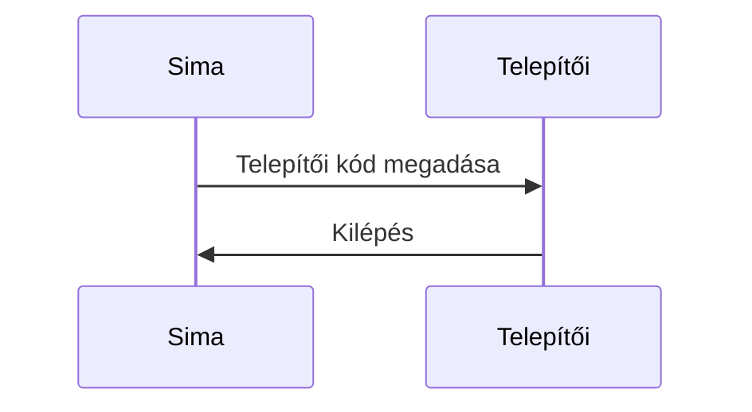
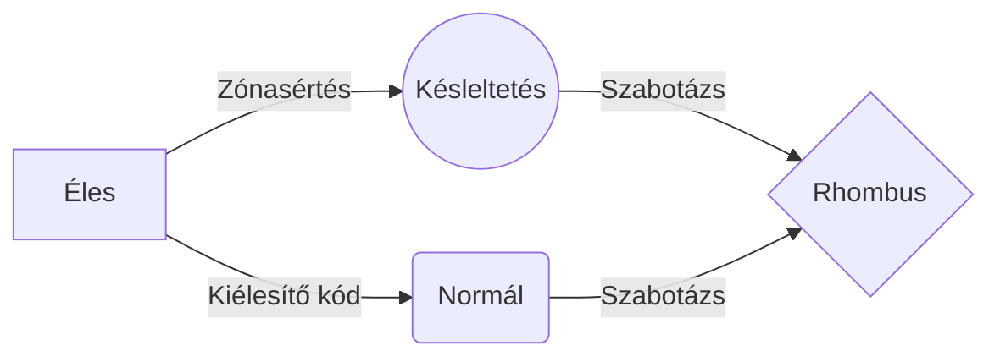

# Követelmények

## Felhasználókezelés

A rendszer kezeljen felhasználókat.
Minden felhasználónak legyen saját 4-6 karakteres kódja.
Pánikkód?
Egy felhasználóhoz lehet egy egyedi 11 byte-os kódot rendelni.
Felhasználóknak jogosultsági szint adható.
Legyen Admin/telepítő szint
Legyen 4 jogosultsági szint
Telepítő
Admin
Emelt szintű user
User
A felsőbb szintű felhasználó módosíthatja az alacsonyabb szintű beállításait
User fiók letiltható, engedélyezhető
Jogosultsági szintek
Kezeljen több felhasználót (több PIN), több jogosultsági szinttel (sima user ne kapcsolhassa ki a szabotázs érzékelést)

  

## I/O
Érzékelők
Áramgenerátoros érzékelő
PIR
infrasorompó
ajtónyitás érzékelő
rezgés
üvegtörés, falbontás
tűzjelző
füstérzékelő
gázérzékelő (gáz, CO)
elárasztásjelző, vízérzékelő, szivárgás
fagy
pánikriasztó/jelző (kézi támadásjelző)
Digitális buszos
Sziréna
Füstgép
Stroboszkóp
Kezelő
RFID
Gombok/tasztatúra
Távirányító
Relé kimenet

## Kommunikáció
GSM
wifi
lora
zigbee
UPNP, MQTT
pushbullet - thingspeak - twitter

## Partíciók, zónák

Zóna: egy-egy érzékelő jele/állapota
Egy zóna lehet
nyitott (megkeresni melyik-melyik)
zárt
szabotázs
inaktív
Partíció: Zónák logikai összerendelése
A rendszer kezeljen 128 zónát
A rendszer kezeljen 16 partíciót

## Kezelő
Kód beírása
Státusz
Rendszerállapot
Zónák állapota
Hibajelzés
Pánik (akár nagyi-pánik gomb?)
Gyors élesítés
RGB státuszled
Sétateszt
RS-485?

## Rendszerállapot

Állapotai
- Telepítő
    > minden megengedett
- Karbantartó
    > vezetékszakadás szabotázs nem megengedett
    > akkumulátorcsere, doboznyitás megengedett
- Kiélesített
- Éles
- Késleltetés
- Beélesítés
- Kiélesítés
- Riaszt
- Sima
- Szabotázs
- Pánik
- Néma

## Hibakódok

Kezelőről új kód, felhasználó létrehozása
master kód indításnál
Factory reset gomb az alaplapon (alkalmasint jumper)
  

Kezeljen gyári Paradox mozgásérzékelőt
Kezeljen gyári szirénát
Kezeljen kezelőt
Kezeljen reed relét / mikrokapcsolót, de mindkettőt szabotázs érzékeléssel (soros 1,1 KOhm)
Kezeljen hall szenzort

  
## Rendszer
“Operációs rendszer”: időzítve fussanak le a feladatok

  

## Programozás

Lehessen programozni kezelőről és PC-ről is
Lehessen riasztásokat, és élesítéseket kulccsal védett soros porton kezelni.
Lehessen kulcsos kapcsolót bekötni

## Időkezelés
Kezeljen naptárat (dátum, óra-perc)
hónapok (30/31)
napok (hétfő-péntek)
piros betűs ünnepek
Automata élesítés / ha nincs mozgás adott idősávban - naptárhoz kötött/

  

Legyenek zónák (szobák)
különböző területek kezelése
több érzékelőt egy zónába lehessen fogni
külön-külön konfigurálható, hogy élesedjen-e
jogosultságfüggő kiélesítés
  
## Riasztás, értesítés
Tudjon riasztani
szirénával
csendesen
internet modul esetén email-en, gsm modul esetén sms-ben.
Riasztás mobileszközre
  
## PC kliens
PC program(Csak ötlet) programozáshoz, kezeléshez, hibakereséshez
python (3as)
grafikusan megjelenített zónák, és partíciók (színekkel kódolt állapotok)
menthető kapcsolatok, amik jelszóval védettek profilok, másik gépre csak jelszóval vihető át
riasztó profil klónozás

  
## Funkciókhoz ötletek:
http://www.paradox-riaszto.hu/letoltesek/felhasznaloknak/MAGELLAN_SPECTRA-EU11_hun.pdf
http://www.paradox-riaszto.hu/letoltesek/telepitoknek123/MGSP-EI05_hun.pdf
https://www.riasztobolt.hu/pictures/down/hu_tmanual_dscmind.pdf
https://www.riasztobolt.hu/pictures/down/hu_tmanual_161618321864.pdf
